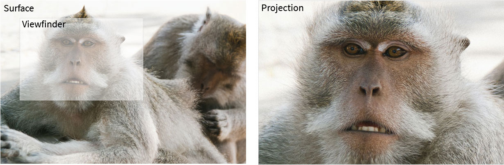

As the name suggests, this plugin simulates image projection. It works by using two similar images for the original and the projection. [See the demo](http://widatama.github.io/jquery-imageprojection)



Whenever the surface is hovered, the viewfinder and the projection come up. Everything covered by the viewfinder is shown as the projection.

##Sample usage

###HTML

Include the scripts and stylesheet.
```html
<link rel="stylesheet" href="stylesheets/image-projection.css">

<script src="javascripts/jquery.min.js"></script>
<script src="javascripts/image.projection.js"></script>
```

Structure the container and image. The image class is important, this image will be the origin image and contains url for projection.
```html
<div class="wrap">
  
</div>
```

###Javascript

Initiate the projection.
```javascript
$(".wrap").imageProjection();
```

Destroy the projection.
```javascript
$(".wrap").imageProjection("destroy");
```

##Development

Install dependencies
```bash
npm install
```

This will build the scripts and copy the stylesheet to dist folder.
```bash
grunt build
```

This will do build mentioned above and then turn on the watcher.
```bash
grunt dev
```

This will run the tests.
```bash
npm test
```

##License

Permission is hereby granted, free of charge, to any person obtaining a copy
of this software and associated documentation files (the "Software"), to deal
in the Software without restriction, including without limitation the rights
to use, copy, modify, merge, publish, distribute, sublicense, and/or sell
copies of the Software, and to permit persons to whom the Software is
furnished to do so, subject to the following conditions:

The above copyright notice and this permission notice shall be included in
all copies or substantial portions of the Software.

THE SOFTWARE IS PROVIDED "AS IS", WITHOUT WARRANTY OF ANY KIND, EXPRESS OR
IMPLIED, INCLUDING BUT NOT LIMITED TO THE WARRANTIES OF MERCHANTABILITY,
FITNESS FOR A PARTICULAR PURPOSE AND NONINFRINGEMENT. IN NO EVENT SHALL THE
AUTHORS OR COPYRIGHT HOLDERS BE LIABLE FOR ANY CLAIM, DAMAGES OR OTHER
LIABILITY, WHETHER IN AN ACTION OF CONTRACT, TORT OR OTHERWISE, ARISING FROM,
OUT OF OR IN CONNECTION WITH THE SOFTWARE OR THE USE OR OTHER DEALINGS IN
THE SOFTWARE.
